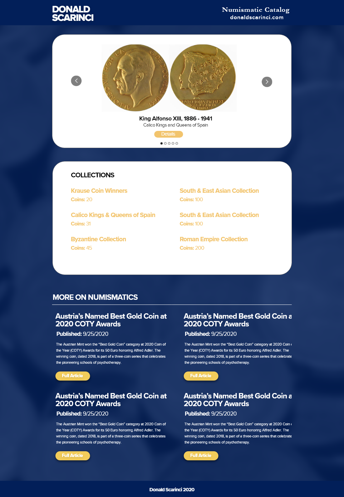

# Numismatic's Catalog

Donald Scarinci's coin collection website.

### [Live Site](https://numismatics-catalog.donaldscarinci.com/)

## Build status


## Code style


## Tech used

**Built with**: 
  
  * [Auth0](https://auth0.com)
  * [Cloudinary](https://cloudinary.com/)
  * [Jest](https://jestjs.io/)
  * [MongoDB](https://www.mongodb.com/)
  * [Mongoose](https://mongoosejs.com/)
  * [Next.js](https://nextjs.org/)
  * [React Lazy Load Image Component](https://www.npmjs.com/package/react-lazy-load-image-component)
  * [React Multi Carousel](https://w3js.com/react-multi-carousel)
  * [React Testing Library](https://testing-library.com)
  * [Storybook](https://storybook.js.org/)
  * [SWR](https://github.com/vercel/swr)
  * [TypeScript](https://www.typescriptlang.org/)  

## Install

```
git clone https://github.com/s1100h/numismatics-catalog.git
cd numismatics-catalog
yarn install
```

## Tests

Add a new test to ```test``` directory. If you are testing a component add it to ```test/components``` or if its a page add it to ```test/pages```. and then run ```yarn test -u```

## Development

Run the install process, open this project in you favorite code editor, create a new branch, and run ```yarn dev```

## Production

To create a production copy of this application run ```yarn build```, then ``` yarn run```, and open ```http://localhost:3000``` in the browser.

### Deployment

The branch ```production``` is hooked to vercel hosting and will run build deployment tests and then copy the repository to cloud hosting. So commit any changes you want to deploy to production to the ```production``` branch.

## Adding a story

Add a new story to `stories` directory. Then run `yarn storybook`.

## Screen shots

This site is responsive to smartphones, tablets, laptops, and desktops. Here are examples of the basic layouts designed in [Adobe XD](https://www.adobe.com/products/xd.html)

**Mobile**


**Tablet & Laptop**



